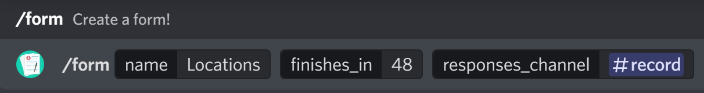

Welcome to Forms's documentation!
=================================

Help Command
------------
``help [command=None]``

The help command for this bot.

Parameters
~~~~~~~~~~
command: Optional[``Text``]
    The command to get help with.

.. note::
    You cannot use this as a slash command. To invoke this use ``@Forms help``.

Info Command
------------
``info``

Get information about the bot.

Parameters
~~~~~~~~~~
This command has no parameters.

Form Commands
-------------
``form <name> <channel> [finishes_in=1] [responses_channel=None] [anonymous=False]``

Create a form!

Parameters
~~~~~~~~~~
name: Required[``Text``]
    The name of the form.

channel: Required[``TextChannel``]
    The channel to send the form in.

finishes_in: Optional[``Number``]
    The hours to finish the form in

responses_channel: Optional[``TextChannel``]
    The channel to send the form responses in, defaults to DMs.

anonymous: Optional[``Boolean``]
    Whether the form is anonymous.

``finish <message> [send_here=False]``

Finish a form early.

Parameters
~~~~~~~~~~
message: Required[``MessageLink`` or ``MessageID``]
    The link or ID to the message that you can start the form from.

send_here: Optional[``Boolean``]
    Whether to send the results in this channel.

Form Commands Walk through
--------------------------

Form Create
~~~~~~~~~~~
Head over to the command menu and select ``/form``.

This menu will pop up.

Select ``Add Short Answer Question`` and this mini form will pop up.

Oops, we entered the wrong question. Click ``Remove Question`` to remove a question.

We now added the correct question. Click ``Finish`` to move on.

You will now see this menu. Select users and roles that can take this form or let anybody!

Now the form will be sent in the specified channel.

Users that click on ``Start Form`` will see this.

When they submit the form, it will be sent to the responses channel.

Form Finish
~~~~~~~~~~~
Go the message you can start the form from and copy the message link.

.. image:: images/message_link.png

Head over to the command menu and select ``finish``.

.. image:: images/command_menu2.png

You have finished the form!

What happens when a form ends?
~~~~~~~~~~~~~~~~~~~~~~~~~~~~~~
The data will be sent to the set channel.

